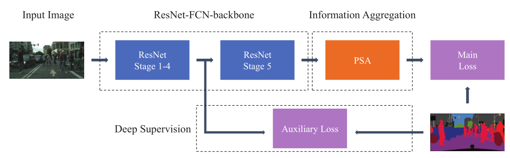
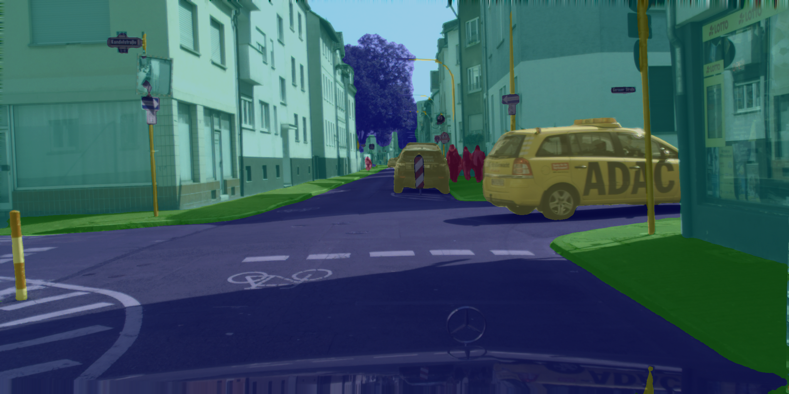
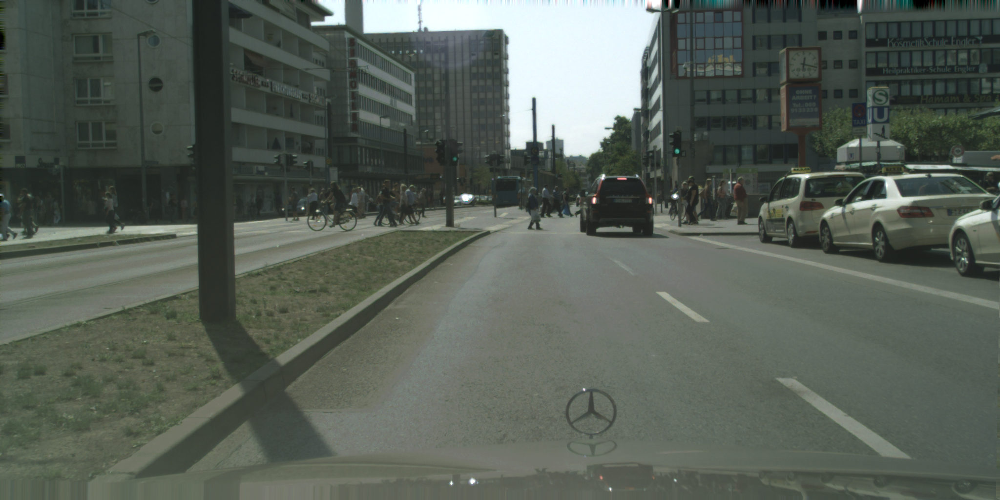

# PSANet_paddle


## 1 简介
  
本项目基于paddlepaddle框架复现了PSANet语义分割模型.  
预测效果如下：


**论文：**
- [1] Hengshuang Zhao, Yi Zhang, Shu Liu, Jianping Shi, Chen Change Loy, Dahua Lin, Jiaya Jia. [PSANet: Point-wise Spatial Attention Network for Scene Parsing](https://hszhao.github.io/papers/eccv18_psanet.pdf)

**项目参考：**
- [https://github.com/hszhao/semseg](https://github.com/hszhao/semseg)

## 2 复现精度
>在CityScapes val数据集的测试效果如下表。


| NetWork | steps |opt| image_size | batch_size |dataset|memory| card |  mIou  |                               config                               |                             weight                             |            log             |
|:-------:|:-----:| :---: |:----------:|:----------:| :---: | :---: |:----:|:------:|:------------------------------------------------------------------:|:--------------------------------------------------------------:|:--------------------------:|
| PSANet  |  80K  |SGD|  1024x512  |     8      |CityScapes|32G|  1   | 79.94% | [psanet_resnet50_os8_cityscapes_1024x512_80k.yml](configs/psanet/psanet_resnet50_os8_cityscapes_1024x512_80k.yml) | [weight 提取码：2fbf](https://pan.baidu.com/s/1gr1Oqc1kWQ0PwhHYQKv88A) | [log](log/trainer-log.txt) |

## 3 数据集
[CityScapes dataset](https://www.cityscapes-dataset.com/)

- 数据集大小:
    - 训练集: 2975
    - 验证集: 500

## 4 环境依赖
- 硬件: Tesla V100 * 1

- 框架:
    - PaddlePaddle == 2.2.2


## 快速开始

### 第一步：克隆本项目
```bash
# clone this repo
git clone https://github.com/justld/PSANet_paddle.git
cd PSANet_paddle
```

**安装第三方库**
```bash
pip install -r requirements.txt
```


### 第二步：训练模型

单卡训练：
```bash
python train.py --config configs\psanet\psanet_resnet50_os8_cityscapes_1024x512_80k.yml  --do_eval --use_vdl --log_iter 100 --save_interval 4000 --save_dir output
```
多卡训练(psamask自定义算子多卡编译可能有问题，不推荐)：
```bash
python -m paddle.distributed.launch train.py --config configs\psanet\psanet_resnet50_os8_cityscapes_1024x512_80k.yml  --do_eval --use_vdl --log_iter 100 --save_interval 1000 --save_dir output
```

### 第三步：测试
权重文件在上方的表格中，先下载权重。
```bash
python val.py --config configs\psanet\psanet_resnet50_os8_cityscapes_1024x512_80k.yml --model_path {your_model_path}
```

### 第四步：tipc
进入PSANet_paddle文件夹，首先准备轻量级训练数据集，命令如下（会下载完整的cityscapes数据集）：
```bash
bash test_tipc/prepare.sh ./test_tipc/configs/psanet/train_infer_python.txt 'lite_train_lite_infer'
```
接着运行训练推理一体化测试脚本：
```bash
bash test_tipc/test_train_inference_python.sh ./test_tipc/configs/psanet/train_infer_python.txt 'lite_train_lite_infer'
```
脚本会自动进行轻量级训练测试和推理，其推理结果如下图（只训练了50 iters，效果比较差）。  
原图（来自cityscapes验证集）：  
  
预测结果（tipc只训练50iters预测结果，resize到512x512）：  
  


## 5 代码结构与说明
**代码结构**
```
├─benchmark  
├─configs  
├─deploy  
├─images  
├─configs  
├─slim  
├─images  
├─output  
├─paddleseg  
├─test_tipc  
│  export.py  
│  predict.py  
│  README.md  
│  README_CN.md  
│  requirements.txt  
│  setup.py  
│  train.py  
│  val.py  
```
**说明**
1、本项目在Aistudio平台，使用Tesla V100 * 1 训练80K miou达到79.94%。  
2、本项目基于PaddleSeg开发。  

## 6 模型信息

相关信息:

| 信息 | 描述                                                                                                                                              |
| --- |-------------------------------------------------------------------------------------------------------------------------------------------------|
| 作者 | 郎督                                                                                                                                              |
| 日期 | 2022年4月                                                                                                                                         |
| 框架版本 | PaddlePaddle==2.2.2                                                                                                                             |
| 应用场景 | 语义分割                                                                                                                                            |
| 硬件支持 | GPU、CPU                                                                                                                                         |
| 在线体验 | [notebook] |


## 7 Citation
```
@misc{semseg2019,
  author={Zhao, Hengshuang},
  title={semseg},
  howpublished={\url{https://github.com/hszhao/semseg}},
  year={2019}
}
@inproceedings{zhao2017pspnet,
  title={Pyramid Scene Parsing Network},
  author={Zhao, Hengshuang and Shi, Jianping and Qi, Xiaojuan and Wang, Xiaogang and Jia, Jiaya},
  booktitle={CVPR},
  year={2017}
}
@inproceedings{zhao2018psanet,
  title={{PSANet}: Point-wise Spatial Attention Network for Scene Parsing},
  author={Zhao, Hengshuang and Zhang, Yi and Liu, Shu and Shi, Jianping and Loy, Chen Change and Lin, Dahua and Jia, Jiaya},
  booktitle={ECCV},
  year={2018}
}
```

